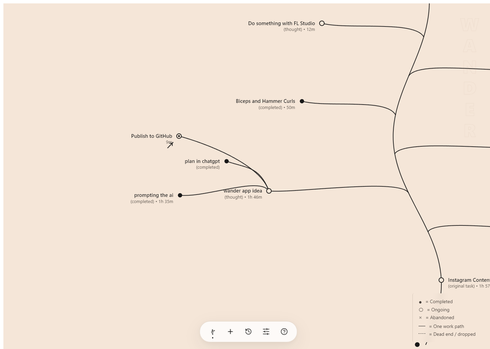

<p align="center">
  
</p>

<h1 align="center">Wander</h1>

<p align="center">
  <strong>Organic Attention Flow Engine</strong><br />
  A minimalist desktop environment designed to track human attention as an evolving botanical tree.
</p>

<p align="center">
  <a href="#releases">Download</a> &bull;
  <a href="#overview">Overview</a> &bull;
  <a href="#key-capabilities">Capabilities</a> &bull;
  <a href="#keyboard-shortcuts">Keyboard Controls</a> &bull;
  <a href="#development">Development</a>
</p>

<br />

<p align="center">
  
</p>

## Overview

Traditional task trackers force exploratory thinking into linear checklists or isolated cards. Human cognition, however, branches naturally:

- A primary objective forms the central trunk.
- Progressive work steps extend the stem upward.
- Exploratory curiosities and tangential ideas branch outward.
- Abandoned thoughts de-stabilize into subtle dashed flows, preserving context without visual clutter.

Wander runs silently in the background, minimizing friction through keyboard-first navigation and ambient edge docking.

## Key Capabilities

- **Botanical Tree Canvas**: Procedural Bézier curves dynamically layout nodes using organic tree growth physics. Older branches remain lower on the trunk, while new thoughts sprout near the active growing tip.
- **Harmonic Living Cursor**: Complete spatial keyboard navigation across nodes using standard arrow keys or Vim bindings (`H`, `J`, `K`, `L`).
- **Radial Action Wheel**: Holding `Shift` on any node reveals a numerical action wheel (`1` through `6`) for instant contextual operations.
- **Dynamic Destabilization**: Abandoned or dropped paths transform into animated, crawling dotted strokes, visually indicating disconnected mental threads.
- **One-Click Branch Cleanup**: `Alt + D` drops all open curiosity branches simultaneously, returning focus to the primary stem.
- **Ambient Edge Docking**: When clicking outside the application, the window fluidly docks into a minimalist right-edge screen handle.
- **Offline Hunspell Autocorrect**: Integrated dictionary engine corrects spelling and normalizes brand capitalization (`chatgpt` to `ChatGPT`) without cloud dependencies.
- **State Persistence**: Preserves active focus and tree context across system shutdowns and tree switches.

## Keyboard Shortcuts

| Shortcut | Description |
| :--- | :--- |
| `↑` `↓` `←` `→` / `H` `J` `K` `L` | Navigate living cursor |
| `Enter` / `Space` | Focus navigated node |
| `Hold Shift` | Reveal radial action menu |
| `Shift + 1` | Add sequential work step |
| `Shift + 2` | Capture exploratory thought |
| `Shift + 3` | Switch attention focus |
| `Shift + 4` | Mark path completed |
| `Shift + 5` | Mark path dropped |
| `Shift + 6` | Delete node and child branches |
| `Delete` / `Backspace` | Delete navigated node |
| `Alt + D` / `Ctrl + Shift + D` | Drop all uncompleted branches |
| `T` / `Ctrl + T` | Quick capture thought |
| `S` / `Ctrl + S` | Quick add work step |
| `Ctrl + N` | Start new primary work |
| `Ctrl + H` | Attention history archive |
| `Ctrl + ,` | Preferences |
| `Ctrl + M` | Dock to screen edge |
| `Ctrl + Q` | Terminate application |

## Releases

Pre-compiled release binaries are available under [GitHub Releases](https://github.com/guider23/Wander/releases):

- **Windows**: `Attention.Path.Setup.X.X.X.exe` (NSIS installer with automated replacement and update)
- **macOS (Apple Silicon & Intel)**: `Attention.Path-X.X.X-arm64.dmg` and universal `.zip` bundles

### macOS Installation Note (Gatekeeper Fix)
Because Attention Path is a free community open-source app and is not signed with an Apple Developer Program certificate ($99/yr), macOS Gatekeeper flags downloaded applications with:
> *"Attention Path" is damaged and can't be opened. You should move it to the Bin.*

To open the app:
1. Drag **Attention Path.app** into your `/Applications` folder.
2. Open Terminal and run this one-line command:
```bash
xattr -cr "/Applications/Attention Path.app"
```
3. Launch Attention Path normally! You only need to run this command once.
*(Alternatively, right-click the app in Finder while holding `Option` and choose **Open**).*

## Development

### Prerequisites

- Node.js (v18 or higher)
- npm

### Installation & Build

```bash
# Clone the repository
git clone https://github.com/your-username/wander.git
cd wander

# Install dependencies
npm install

# Run Vite dev server in browser
npm run dev

# Run Electron desktop application
npm start

# Execute unit tests
npx vitest run tests/unit

# Package Windows installer
npm run package:win

# Package macOS distribution (DMG & ZIP)
npm run package:mac
```

## Architecture

- **Interface**: React 19, TypeScript, Tailwind CSS, Lucide Icons, Procedural SVG Graph Engine.
- **Runtime**: Electron 34 with context isolation, IPC communication, and system tray integration.
- **Persistence**: SQLite (`better-sqlite3`) with append-only domain event sourcing and snapshot reducers.
- **Language Processing**: Offline Hunspell dictionary engine (`nspell` + `dictionary-en`).

## License

MIT License. See [LICENSE](./LICENSE) for details.
